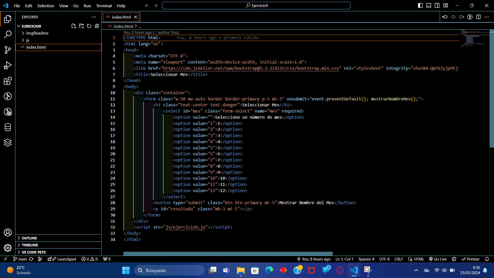
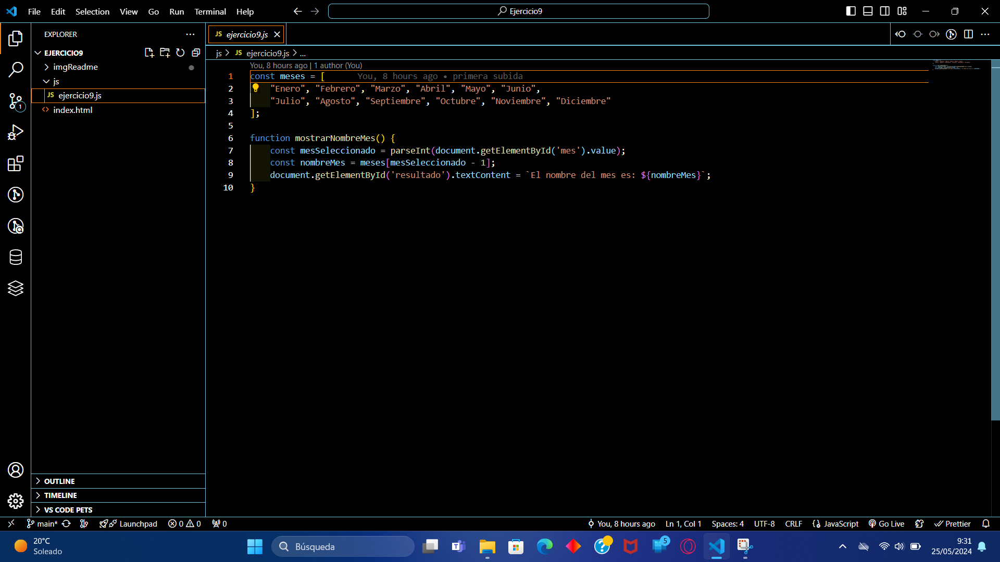
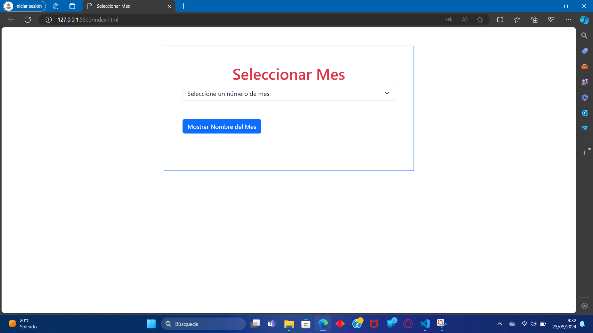
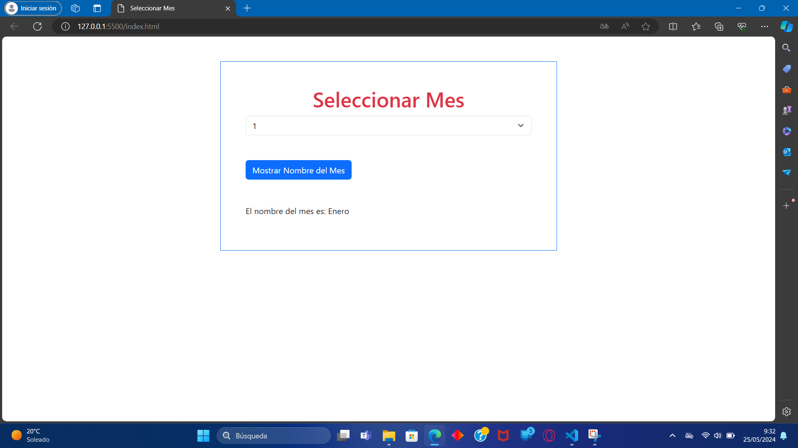
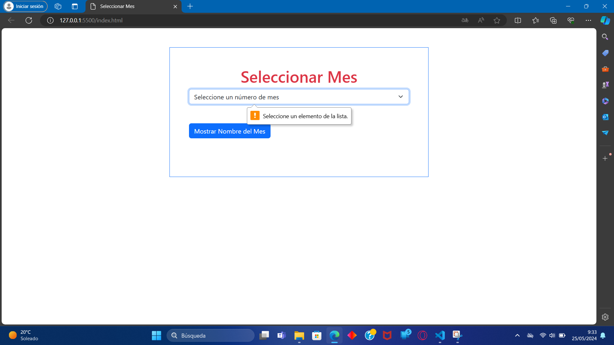

<h1>Memoria del proyecto fin de evaluación de Lenguajes de Marcas - 1º DAW</h1>
<h2>Relaciones de ejercicios de JavaScript</h2>

<h2>Índice</h2>
<ul>
  <li><a href="#introduccion">Introducción</a></li>
  <li><a href="#imagenes">Imágenes</a></li>
  <li><a href="#estilo">Estilo</a></li>
</ul>

<h2 id="introduccion">Introducción</h2>

Trabajo realizado por: Daniel Trujillo Fernández

Proyecto de web desde cero de 3ª evaluación del módulo Lenguajes de Marcas

mayo de 2023

<h2 id="imagenes">Imágenes</h2>

La web está dividida en  6 secciones:

<ul>
  <li>Codigo HTML</li>  
  <li>JavaScript</li>
  <li>Primera vision del proyecto</li>
  <li>Resultado esperado</li>
  <li>Mensaje de error</li>
</ul>

<h3>Codigo HTML</h3>

En la siguiente imagen se puede ver el codigo HTML

<h3>JavaScript</h3>

En la siguiente imagen se puede ver el codigo JavaScript del ejercicio

<h3>Primera vision del proyecto</h3>

Se puede observar el formulario base

<h3>Resultado esperado</h3>

Se puede observar el formulario cuando hace su cometido.

<h3>Mensaje de error</h3>

Se aprecia de que el formulario te envia un mensaje de error

<h2 id="estilo">Estilo de la página</h2>

  <li>(<a href="https://getbootstrap.com/">Bootstrap</a>)</li>

